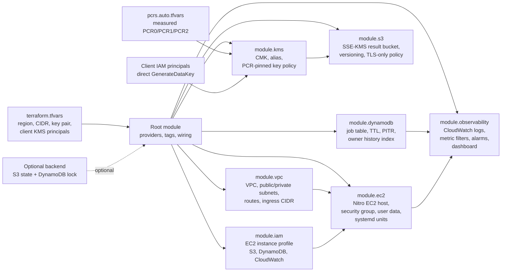

# MedSeal

MedSeal is a confidential-computing reference implementation for processing medical records on AWS Nitro Enclaves. The system encrypts records on the client, sends only ciphertext to an untrusted Spring Boot gateway, decrypts and processes the record inside a Nitro Enclave after KMS recipient attestation, and returns an encrypted result.

The goal is not to claim a finished regulated healthcare platform. The goal is to demonstrate a working end-to-end trust pipeline for data-in-use protection:

- client-side envelope encryption
- Nitro Enclave isolation
- NSM attestation
- KMS key release pinned to measured PCR0/PCR1/PCR2
- vsock-only enclave communication
- encrypted S3 result storage
- DynamoDB job tracking
- CloudWatch audit and operational visibility

## Current Status

The hard confidential-computing path has been validated on live AWS Nitro hardware.

Most recent live validation: May 13, 2026, `us-east-1`, AWS profile `medseal`.

Results:

- Terraform destroyed the prior stack cleanly, then recreated 35 AWS resources from code.
- Nitro Enclave started on CID 16 with 2 vCPUs and 4 GiB memory.
- Runtime PCR0/PCR1/PCR2 matched `infrastructure/pcrs.auto.tfvars`.
- Gateway health returned all dependencies `UP`: gateway, enclave, NSM, KMS, and spaCy.
- An encrypted processing job completed through the direct-KMS CLI path in 631 ms.
- Decrypted output removed the test name, MRN, phone number, and date canaries.
- The result classified hypertension and type 2 diabetes as ICD-10 `I10` and `E11`.
- A mismatched authenticated principal was rejected by the gateway with HTTP 400.
- A tampered `{jobId, principal}` encryption context failed closed at KMS with HTTP 400.
- DynamoDB recorded the completed job and S3 stored the encrypted result object.
- CloudWatch dashboard `medseal-dev-operations` exists for operational visibility.

The AWS stack was live at the time of this validation. Destroy it after demos to avoid cost.

## What MedSeal Proves

MedSeal proves that a cloud application can process sensitive records without giving plaintext access to the parent EC2 host, the gateway process, the network path, or storage services.

The security property comes from the composition of three controls:

1. **Isolation** - Nitro Enclaves isolate memory and execution from the parent EC2 host.
2. **Attestation** - the Nitro Secure Module signs the enclave's measured identity.
3. **Policy-gated key release** - AWS KMS releases plaintext data keys only when the attestation PCRs match the values pinned in the KMS key policy.

The included workload performs PHI de-identification and ICD-10 rule-based classification. That workload is intentionally replaceable. If the enclave model or processing code changes, the EIF measurement changes, PCR0 changes, and KMS will stop releasing keys until the new PCRs are reviewed and applied through Terraform.

## Architecture

```text
Client
  Python CLI or React UI
  - calls KMS GenerateDataKey directly
  - encrypts record with AES-256-GCM
  - sends ciphertext + KMS CiphertextBlob
        |
        | HTTPS in production, HTTP only for explicit demo mode
        v
Spring Boot Gateway on EC2
  - authenticates requests
  - validates envelope fields
  - tracks jobs in DynamoDB
  - stores encrypted results in S3
  - sends ciphertext to enclave over vsock
  - never needs plaintext PHI
        |
        | AF_VSOCK
        v
AWS Nitro Enclave
  - no NIC, no disk, no shell
  - requests NSM attestation
  - uses kmstool-enclave-cli for attested KMS operations
  - decrypts data key inside enclave memory
  - decrypts record, processes it, re-encrypts result
        |
        | vsock-proxy to KMS endpoint
        v
AWS KMS
  - verifies recipient attestation
  - enforces PCR0/PCR1/PCR2 key-policy conditions
  - returns key material only to the attested recipient
```

## Terraform Architecture

Terraform is part of the security architecture, not just provisioning glue. The root module wires the trust boundary, storage boundary, network boundary, and observability boundary from declarative code.



Important design points:

- `module.kms` fails closed unless real PCR values are supplied. Placeholder PCRs are rejected by Terraform preconditions.
- KMS cryptographic access is enforced by the KMS key policy using `kms:RecipientAttestation:PCR0`, `PCR1`, and `PCR2`.
- The EC2 role has storage, DynamoDB, and logging permissions, but it is not trusted with plaintext PHI.
- S3 uses the same KMS key only through the `kms:ViaService` path for server-side encryption.
- Every enclave workload change changes PCR0, forcing a new build, measurement review, and Terraform apply before keys are released.

## Repository Map

```text
.
├── cli/                         Python client for direct-KMS envelope encryption
├── client/                      React + TypeScript UI and operations dashboard
├── enclave/                     Python Nitro Enclave application
│   └── src/
│       ├── attestation/         NSM attestation providers
│       ├── crypto/              kmstool + AES-GCM processing
│       ├── processing/          PHI de-id and ICD-10 workload
│       └── transport/           vsock server/client framing
├── gateway/                     Java 17 Spring Boot gateway
│   └── src/main/java/com/medseal/gateway/
│       ├── audit/               structured audit logging
│       ├── controller/          process, jobs, and health APIs
│       ├── security/            dev-token/JWT security and production guardrails
│       └── service/             vsock, job, storage, and enclave services
├── infrastructure/              Terraform modules for AWS runtime
│   └── modules/
│       ├── dynamodb/            job table, TTL, PITR, owner index
│       ├── ec2/                 Nitro-enabled host and systemd bootstrap
│       ├── iam/                 EC2 role policies
│       ├── kms/                 PCR-pinned KMS key policy
│       ├── observability/       CloudWatch logs, metrics, alarms, dashboard
│       ├── s3/                  encrypted result bucket
│       └── vpc/                 networking
├── scripts/                     build, PCR extraction, deploy, proof scripts
├── report.tex                   technical report
└── MedSeal_Grad_Demo.pptx       retained presentation deck
```

## Security Model

Trusted:

- AWS Nitro hardware and Nitro Hypervisor
- AWS KMS policy enforcement
- the user's client device for its own plaintext record
- standard cryptographic primitives

Not trusted:

- EC2 parent host OS
- Spring Boot gateway process
- root on the EC2 host
- network observers
- S3 and DynamoDB with respect to plaintext content
- operators who can view host logs or packet captures

Out of scope:

- side-channel CPU attacks
- denial of service
- malicious or compromised client device
- compromise of AWS hardware or KMS itself
- clinical accuracy certification for the sample PHI/ICD workload

## APIs

Gateway endpoints:

- `GET /api/v1/health`
- `POST /api/v1/process`
- `GET /api/v1/jobs`
- `GET /api/v1/jobs/{jobId}`
- `GET /api/v1/jobs/{jobId}/result`

There is deliberately no supported `POST /api/v1/datakey` endpoint. Data keys are generated by the client using KMS directly; the gateway should not become a plaintext data-key broker.

## Prerequisites

Local tooling:

- AWS CLI v2
- Terraform 1.5+
- Java 17
- Maven
- Python 3.11+
- Docker
- Node.js 20+
- Nitro Enclaves CLI on the host that builds/measures the EIF

AWS requirements:

- IAM permission to create VPC, EC2, IAM, KMS, S3, DynamoDB, and CloudWatch resources
- an EC2 key pair, referenced by `infrastructure/terraform.tfvars`
- an allowed ingress CIDR for SSH and demo gateway access
- client IAM principal ARNs allowed to call KMS directly for `GenerateDataKey`

## Local Validation

Run these before deploying:

```bash
# Gateway
mvn -f gateway/pom.xml -B test

# Enclave unit tests
PYTHONPATH=enclave .venv/bin/pytest enclave/tests

# CLI and infrastructure policy tests
.venv/bin/pytest cli/tests infrastructure/tests

# React client
cd client
npm ci
npm run build
cd ..

# Terraform syntax and provider validation
AWS_PROFILE=medseal AWS_REGION=us-east-1 terraform -chdir=infrastructure validate
```

Latest local validation results:

- gateway tests: 15 passed
- selected enclave crypto/pipeline tests: 28 passed
- CLI envelope tests: 3 passed
- React build: passed
- Terraform validate: passed

## Deployment Workflow

MedSeal uses a two-stage trust bootstrap because PCRs are known only after the EIF is built, while the KMS policy needs those PCRs before production decrypts can succeed.

### 1. Configure Terraform

```bash
cd infrastructure
cp terraform.tfvars.example terraform.tfvars
```

Set at least:

- `aws_region`
- `project_name`
- `environment`
- `instance_type`
- `key_name`
- `allowed_ingress_cidr`
- `client_kms_principal_arns`

For a fail-closed bootstrap, use `pcrs.bootstrap.tfvars`. For a measured deployment, use `pcrs.auto.tfvars`.

### 2. Apply Infrastructure

```bash
AWS_PROFILE=medseal AWS_REGION=us-east-1 terraform -chdir=infrastructure init
AWS_PROFILE=medseal AWS_REGION=us-east-1 terraform -chdir=infrastructure apply
```

Save outputs:

```bash
AWS_PROFILE=medseal AWS_REGION=us-east-1 terraform -chdir=infrastructure output -json
```

### 3. Build Gateway

```bash
mvn -f gateway/pom.xml -B package -DskipTests
```

### 4. Build and Measure EIF

On a Nitro-capable build host with Nitro CLI:

```bash
./scripts/build-enclave.sh
./scripts/extract-pcrs.sh build/medseal.eif > infrastructure/pcrs.auto.tfvars
```

Re-apply Terraform so KMS pins the measured PCRs:

```bash
AWS_PROFILE=medseal AWS_REGION=us-east-1 terraform -chdir=infrastructure apply
```

### 5. Deploy Runtime Artifacts

Development/demo deployment:

```bash
export AWS_PROFILE=medseal
export AWS_REGION=us-east-1
export MEDSEAL_DEPLOY_HOST=<ec2-public-ip>
export MEDSEAL_SSH_KEY=~/.ssh/medseal-dev.pem
export MEDSEAL_ENV=development
export SPRING_PROFILES_ACTIVE=dev
export MEDSEAL_ALLOW_INSECURE_DEMO=true
export MEDSEAL_TLS_ENABLED=false
export MEDSEAL_KMS_KEY_ID=<kms-key-arn>
export MEDSEAL_S3_BUCKET_NAME=<s3-bucket>
export MEDSEAL_DYNAMODB_TABLE_NAME=<dynamodb-table>
export MEDSEAL_DEV_TOKEN=dev-medseal-token
export MEDSEAL_DEV_PRINCIPAL=dev-user

./scripts/deploy.sh
```

Production deployment requires TLS and JWT configuration:

```bash
export MEDSEAL_ENV=production
export SPRING_PROFILES_ACTIVE=prod
export MEDSEAL_TLS_ENABLED=true
export MEDSEAL_TLS_KEYSTORE_SOURCE=/path/to/keystore.p12
export MEDSEAL_TLS_KEYSTORE=/etc/medseal/tls/keystore.p12
export MEDSEAL_TLS_KEYSTORE_PASSWORD=<secret>
export MEDSEAL_JWT_ISSUER_URI=<issuer-uri>
# or MEDSEAL_JWT_JWK_SET_URI=<jwks-uri>
```

The deploy script refuses non-development deployments without TLS and JWT configuration.

## Run a Processing Request

```bash
cat > /tmp/patient.txt <<'EOF'
Patient Jonathan Doe, MRN 998877, SSN 123-45-6789, phone 555-123-9876,
visited on 2026-05-07. Diagnoses include diabetes mellitus, hypertension,
chronic kidney disease, and asthma.
EOF

AWS_PROFILE=medseal AWS_REGION=us-east-1 \
MEDSEAL_TOKEN=dev-medseal-token \
MEDSEAL_PRINCIPAL=dev-user \
.venv/bin/python cli/medseal_cli.py \
  --gateway-url http://<ec2-public-ip>:8080 \
  --kms-key-id <kms-key-arn> \
  encrypt-and-process \
  --file /tmp/patient.txt \
  --output /tmp/medseal-result.json
```

Expected result:

- job status `COMPLETED`
- de-identified output contains no original name, MRN, SSN, or phone canary
- ICD-10 output includes matches such as `I10`, `E11`, `J45`, and `N18.9` for the sample text

## Health and Operations

Gateway health:

```bash
curl -fsS http://<ec2-public-ip>:8080/api/v1/health
```

Expected development response:

```json
{"status":"UP","nsm":"UP","kms":"UP","gateway":"UP","spacy":"UP","enclave":"UP"}
```

Host checks:

```bash
ssh -i ~/.ssh/medseal-dev.pem ec2-user@<ec2-public-ip> '
  systemctl is-active medseal-kms-proxy medseal-gateway nitro-enclaves-allocator amazon-cloudwatch-agent || true
  sudo nitro-cli describe-enclaves
'
```

CloudWatch checks:

```bash
AWS_PROFILE=medseal AWS_REGION=us-east-1 \
aws logs describe-log-groups --log-group-name-prefix /aws/medseal

AWS_PROFILE=medseal AWS_REGION=us-east-1 \
aws cloudwatch describe-alarms \
  --alarm-names medseal-dev-jobs-failed medseal-dev-enclave-hangup
```

## Browser UI

The React UI provides:

- dependency health tiles
- recent owner-scoped job history
- upload and processing flow
- trust-chain details
- decrypted result display

Run locally:

```bash
cd client
VITE_API_URL=http://<ec2-public-ip>:8080 \
VITE_MEDSEAL_TOKEN=dev-medseal-token \
VITE_MEDSEAL_KMS_KEY_ID=<kms-key-arn> \
npm run dev -- --host 0.0.0.0 --port 5173
```

Browser upload uses direct KMS through the AWS SDK for JavaScript. For real browser use, provide short-lived scoped AWS credentials through an identity broker such as Cognito/STS. Do not embed long-lived AWS access keys in a browser bundle.

## Destroy the Stack

When the demo is finished:

```bash
AWS_PROFILE=medseal AWS_REGION=us-east-1 \
terraform -chdir=infrastructure destroy -auto-approve
```

Verify local Terraform state is empty:

```bash
terraform -chdir=infrastructure state list
```

## Known Limitations

- KMS `EncryptionContext` and AES-GCM AAD are implemented with `{jobId, principal}`. The `principal` value must match the gateway-authenticated principal; otherwise the gateway rejects the request before it reaches the enclave.
- Browser identity is not production-complete. A real deployment needs brokered short-lived credentials for direct KMS.
- The sample PHI de-identification and ICD-10 rules are demonstration workload logic, not clinically certified models.
- TLS/JWT guardrails exist, but certificate provisioning and identity-provider operations are outside this prototype.
- Remote Terraform backend support is staged, but state migration remains an account bootstrap step.
- Side-channel attacks and denial of service are outside the current threat model.

## Customizing the Enclave Workload

To swap the medical processor:

1. Change code or model artifacts under `enclave/src/processing/`.
2. Rebuild the EIF with `scripts/build-enclave.sh`.
3. Extract new PCRs with `scripts/extract-pcrs.sh`.
4. Re-apply Terraform so KMS pins the new measured identity.
5. Redeploy with `scripts/deploy.sh`.

This is the intended safety behavior. A modified workload should not inherit key access from an older measured binary.

## Report and Presentation

- Technical report: `report.tex` and `report.pdf`
- Retained deck: `MedSeal_Grad_Demo.pptx`
- Architecture notes: `ARCHITECTURE.md`
